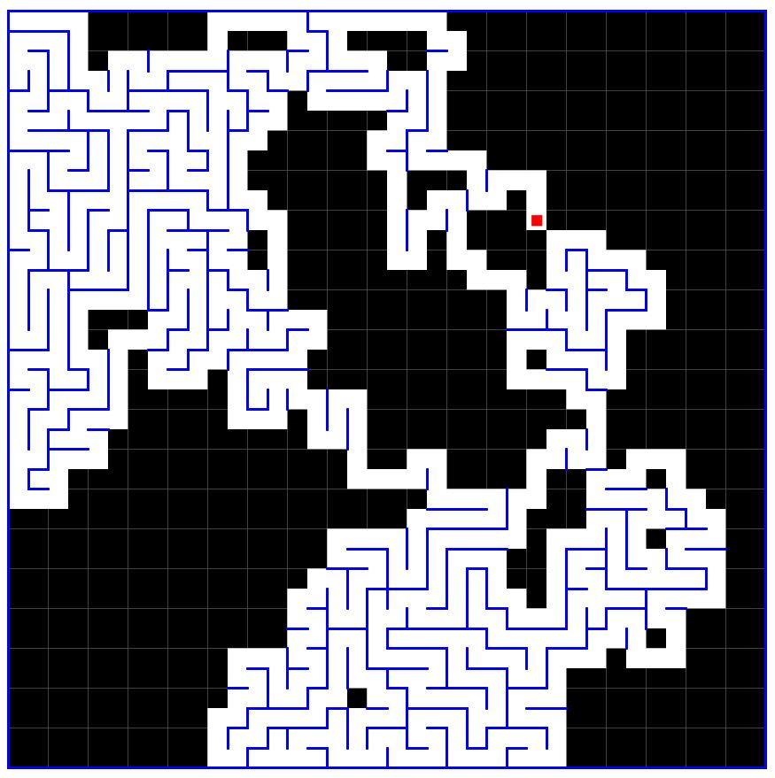

# Maze-generator

Maze generator using a DFS graph traversal algorithm on an square grid (resulition is adjustable).

The process is animated with 3 steps/frame, a tiny red dot "draws" the maze by randomly moving to adjacent grid cells.

Example frame of a generation animation:

